# 🎥 MatrixRTC Authorization Service

The **MatrixRTC Authorization Service** bridges Matrix and LiveKit, handling
authentication and room creation when needed.

## IF info is not sufficient you can check official github repo
[Element-HQ Livekit JWT Service](https://github.com/element-hq/lk-jwt-service)
## THIS IS NOT OFFICIAL DISTRIBUTION SO NO SUPPORT GURANTEED
## USE AT YOUR OWN RISK ABIDE BY LICENSE
## 💡 TL;DR

Matrix user wants to start or join a call?

👤 ➡️ Gets OpenID token ➡️ Sends it to the **MatrixRTC Authorization Service** ➡️
Receives LiveKit JWT ➡️

- **If full-access user** ➡️ Can trigger LiveKit room creation (if needed) ➡️
  Joins the call 🎉
- **If restricted user** ➡️ Can join existing rooms ➡️ Joins the call 🎉

📡 Once connected, the LiveKit SFU handles all real-time media routing so
participants can see and hear each other.

## 🏗️ MatrixRTC Stack: Architecture Overview

<p align="center">
  
</p>

## 📌 When to Use

This service is part of the **MatrixRTC stack** and is primarily used when the
[LiveKit RTC backend (MSC4195)](https://github.com/matrix-org/matrix-spec-proposals/pull/4195)
is in use.

As outlined in the
[Element Call Self-Hosting Guide](https://github.com/element-hq/element-call/blob/livekit/docs/self-hosting.md),
you’ll also need:

- A [LiveKit SFU](https://github.com/livekit/livekit)
- MatrixRTC-compatible clients such as
  [Element Call](https://github.com/element-hq/element-call), which can run
  either:
  - As a standalone Single Page Application (SPA) or
  - Embedded for in-app calling

## ✨ What It Does

🔑 **Generates JWT tokens** for a given LiveKit identity and room derived from
the Matrix user and Matrix room, allowing users to authenticate with the LiveKit
SFU.

🛡️ **Manages user access levels** to ensure the proper and secure use of
infrastructure:

- **Full-access users** — Matrix users from homeservers in the same or related
  deployment as the MatrixRTC backend. Can trigger automatic LiveKit room
  creation if needed.
- **Restricted users** — All other Matrix users. Can join existing LiveKit SFU
  rooms, but cannot auto-create new ones.

🏗️ **Auto-creates LiveKit rooms** for full-access users if they don’t already
exist.

> [!NOTE]
> This setup ensures resources are used appropriately while still supporting
> seamless cross-federation MatrixRTC sessions, e.g., video calls. Remote users
> (not on the same deployment) can join existing rooms, but only full-access
> (local) users can trigger room creation. The SFU selection algorithm and event
> ordering ensure that conferences across Matrix federation remain fully
> functional.

## 🗺️ How It Works — Enhanced Security Flow

### 🏆 Full Access Homeservers (V1 Default)

```mermaid
sequenceDiagram
    participant U as 🧑 User
    participant M as 🏢 Matrix Homeserver (Trusted)
    participant A as 🔐 MatrixRTC Authorization Service
    participant L as 📡 LiveKit SFU

    U->>M: Requests OpenID token
    M-->>U: Returns OpenID token
    U->>A: Sends OpenID token & room request
    
    Note over A: Access Control Check
    A->>A: Check allowlist & restrictions
    
    Note over A,M: V1 Verification (Default)
    A->>M: Validates token via federation API
    M-->>A: Returns user identity
    
    Note over A,L: Duplicate Session Prevention
    A->>L: Check if room exists
    L-->>A: Room status & participants
    A->>A: Check device/user duplicates (if enabled)
    
    A->>A: Generates LiveKit JWT
    A->>L: Create room if missing (full access)
    A-->>U: Returns LiveKit JWT
    U->>L: Connects to room using JWT
```

### V2 is Available in AMS fork of Synapse.
### at https://github.com/alessblaze/synapse
### Currently use V1 as it is what current Synapse offers.
### This code is completely rewritten from scratch.
### The LiveKit itself is written in golang so we didn't
### Bother to change it to some other Language as Rust
### is the only contender but rust does not have a webserver
### like golang.
### 🏆 Full Access Homeservers (V2 Enhanced Security)

```mermaid
sequenceDiagram
    participant U as 🧑 User
    participant M as 🏢 Matrix Homeserver (Trusted)
    participant A as 🔐 MatrixRTC Authorization Service
    participant L as 📡 LiveKit SFU

    U->>M: Requests OpenID token
    M-->>U: Returns OpenID token
    U->>A: Sends OpenID token & room request
    
    Note over A: Access Control Check
    A->>A: Check allowlist & restrictions
    
    Note over A,M: V2 Enhanced Security
    A->>M: 1. Homeserver identity verification
    M-->>A: Ed25519 signed response
    A->>M: 2. User identity verification + device validation
    M-->>A: Cryptographically signed user info
    
    A->>A: Validates signatures, timestamps, nonces
    
    Note over A,L: Duplicate Session Prevention
    A->>L: Check if room exists
    L-->>A: Room status & participants
    A->>A: Check device/user duplicates (if enabled)
    
    A->>A: Generates LiveKit JWT
    A->>L: Create room if missing (full access)
    A-->>U: Returns LiveKit JWT
    U->>L: Connects to room using JWT
```


### 🌐 Restricted Homeservers (V1 Federation)

```mermaid
sequenceDiagram
    participant U as 🧑 User
    participant M as 🌐 Matrix Homeserver (External)
    participant A as 🔐 MatrixRTC Authorization Service
    participant L as 📡 LiveKit SFU

    U->>M: Requests OpenID token
    M-->>U: Returns OpenID token
    U->>A: Sends OpenID token & room request
    
    Note over A: Access Control Check
    A->>A: Check allowlist & restrictions
    
    Note over A,M: V1 Verification (Default)
    A->>M: Validates token via federation API
    M-->>A: Returns user identity
    
    Note over A,L: Room Existence & Duplicate Check
    A->>L: Check if room exists
    L-->>A: Room status & participants
    A->>A: Verify room exists (required for restricted)
    A->>A: Check device/user duplicates (if enabled)
    
    A->>A: Generates LiveKit JWT (join-only)
    Note over A,L: No room creation for restricted users
    A-->>U: Returns LiveKit JWT
    U->>L: Joins existing room using JWT
```


## 🚀 Installation

Releases are available
**[here](https://github.com/alessblaze/livekit-jwt-service-ams/releases)**.

### 🐳 From Docker Image

**Basic Setup:**
```shell
docker run -e LIVEKIT_URL="ws://somewhere" -e LIVEKIT_KEY=devkey -e LIVEKIT_SECRET=secret -e LIVEKIT_FULL_ACCESS_HOMESERVERS=example.com -p 8080:8080 ghcr.io/element-hq/lk-jwt-service:0.3.0
```

**Enhanced Security Setup:**
```shell
docker run \
  -e LIVEKIT_URL="wss://livekit.example.com" \
  -e LIVEKIT_KEY=your_api_key \
  -e LIVEKIT_SECRET=your_api_secret \
  -e LIVEKIT_FULL_ACCESS_HOMESERVERS=internal.company.com \
  -e LIVEKIT_ALLOWED_HOMESERVERS=internal.company.com,partner.org \
  -e MATRIX_VERIFICATION_METHOD=v2 \
  -e MATRIX_PRIVATE_KEY=your_base64_private_key \
  -e SYNAPSE_PUBLIC_KEY=homeserver_base64_public_key \
  -p 8080:8080 \
  ghcr.io/element-hq/lk-jwt-service:0.3.0
```

### 📦 From Release File

1. Download & extract:

```shell
wget https://github.com/alessblaze/livekit-jwt-service-ams/archive/refs/heads/master.tar.gz
tar -xvf master.tar.gz
mv livekit-jwt-service-ams-master livekit-jwt-service-ams
```

2. Build:

```shell
cd livekit-jwt-service-ams
go build -o livekit-jwt-service-ams .
```

3. Run locally:

**Basic:**
```shell
LIVEKIT_URL="ws://somewhere" LIVEKIT_KEY=devkey LIVEKIT_SECRET=secret LIVEKIT_FULL_ACCESS_HOMESERVERS=example.com ./livekit-jwt-service-ams
```

**With Enhanced Security:**
```shell
LIVEKIT_URL="wss://livekit.example.com" \
LIVEKIT_KEY=your_api_key \
LIVEKIT_SECRET=your_api_secret \
LIVEKIT_FULL_ACCESS_HOMESERVERS=internal.company.com \
MATRIX_VERIFICATION_METHOD=v2 \
MATRIX_PRIVATE_KEY=your_base64_private_key \
SYNAPSE_PUBLIC_KEY=homeserver_base64_public_key \
./livekit-jwt-service-ams
```

## ⚙️ Configuration

Set environment variables to configure the service:

### 🔧 Core Configuration

| Variable                                      | Description                                                        | Required                                                     |
| --------------------------------------------- | ------------------------------------------------------------------ | ------------------------------------------------------------ |
| `LIVEKIT_URL`                                 | WebSocket URL of the LiveKit SFU                                   | ✅ Yes                                                       |
| `LIVEKIT_KEY` / `LIVEKIT_KEY_FROM_FILE`       | API key or file path for LiveKit SFU                               | ✅ Yes                                                       |
| `LIVEKIT_SECRET` / `LIVEKIT_SECRET_FROM_FILE` | API secret or file path for LiveKit SFU                            | ✅ Yes                                                       |
| `LIVEKIT_KEY_FILE`                            | File path with `APIkey: secret` format                             | ⚠️ mutually exclusive with `LIVEKIT_KEY` and `LIVEKIT_SECRET` |
| `LIVEKIT_JWT_PORT`                            | Port to listen on (default: `8080`)                                | ❌ No                                                        |

### 🛡️ Access Control & Security

| Variable                                      | Description                                                        | Default                                                      |
| --------------------------------------------- | ------------------------------------------------------------------ | ------------------------------------------------------------ |
| `LIVEKIT_FULL_ACCESS_HOMESERVERS`             | Comma-separated list of trusted homeservers with full access       | `*` (all homeservers)                                       |
| `LIVEKIT_ALLOWED_HOMESERVERS`                 | Comma-separated allowlist - only these homeservers can connect     | Empty (no restriction)                                       |
| `LIVEKIT_BLOCKED_HOMESERVERS`                 | Comma-separated list of homeservers to explicitly block            | Empty (no homeservers blocked)                              |
| `LIVEKIT_BLOCK_RESTRICTED_HOMESERVERS`        | Block homeservers not in full access list (`true`/`false`)         | `false`                                                      |
| `LIVEKIT_BLOCK_SAME_DEVICE_DUPLICATE`         | Prevent same device from joining room twice (`true`/`false`)        | `false`                                                      |
| `LIVEKIT_BLOCK_SAME_USER_MULTIPLE_DEVICES`    | Prevent same user from joining with multiple devices (`true`/`false`) | `false`                                                      |
| `LIVEKIT_IS_PUBLIC_FACING`                    | Enable SSRF protection for public deployments (`true`/`false`)     | `false`                                                      |
| `REQUIRE_OCSP_STAPLE`                         | Require OCSP stapling for TLS connections (`true`/`false`)         | `false`                                                      |
| `LIVEKIT_INSECURE_SKIP_VERIFY_TLS`            | Skip TLS verification - **TESTING ONLY** (`YES_I_KNOW_WHAT_I_AM_DOING`) | `false`                                                      |

### 🔐 Matrix Verification (Enhanced Security)

| Variable                                      | Description                                                        | Default                                                      |
| --------------------------------------------- | ------------------------------------------------------------------ | ------------------------------------------------------------ |
| `MATRIX_VERIFICATION_METHOD`                  | Verification method: `v1` (user only) or `v2` (homeserver + user) | `v1` (default)                                               |
| `MATRIX_PRIVATE_KEY`                          | Base64-encoded Ed25519 private key for signing                     | Required if verification method is v2                       |
| `SYNAPSE_PUBLIC_KEY`                          | Base64-encoded Ed25519 public key for verification                 | Required if verification method is v2                       |
| `MATRIX_VERIFICATION_TEST_ON_START`           | Test verification method on startup (`true`/`false`)               | `false`                                                      |
| `MATRIX_TEST_SERVER`                          | Test server for startup verification                               | Uses first full access homeserver                           |
| `MATRIX_DEBUG_FAKE_DEVICE_ID`                 | Use fake device IDs for testing (`true`/`false`)                   | `false`                                                      |
| `LIVEKIT_TEST_FAKE_V2_SIGNATURE`              | Simulate tampered signatures for testing (`true`/`false`)          | `false`                                                      |

#### Enhanced Verification Methods

**V1 Verification (Default):**
```bash
# Default behavior - no configuration needed
# Or explicitly set:
MATRIX_VERIFICATION_METHOD=v1
```
- **Default verification method**
- Uses standard Matrix federation protocol `/_matrix/federation/v1/openid/userinfo`
- Compatible with all Matrix homeservers
- No Ed25519 keys required
- No device validity checking

**V2 Verification (Enhanced Security):**
```bash
MATRIX_VERIFICATION_METHOD=v2
MATRIX_PRIVATE_KEY=your_base64_private_key
SYNAPSE_PUBLIC_KEY=homeserver_base64_public_key
```
- **Step 1**: Homeserver identity verification (server-to-server)
- **Step 2**: Enhanced user identity verification with device ID validation
- Maximum security with dual verification layers
- Prevents homeserver impersonation attacks
- Uses **custom** `/_matrix/client/r0/identity/verify` endpoint for device validation
- **Requires custom homeserver implementation**

### 🐛 Debugging & Testing

| Variable                                      | Description                                                        | Default                                                      |
| --------------------------------------------- | ------------------------------------------------------------------ | ------------------------------------------------------------ |
| `LIVEKIT_DEBUG`                               | Enable debug logging (`true`/`false`)                              | `false`                                                      |
| `LIVEKIT_TEST_FAKE_V2_SIGNATURE`              | Simulate tampered signatures for security testing (`true`/`false`) | `false`                                                      |

## 🔒 Security Architecture

The service implements a **two-tier security model**:

### 🏆 Full Access Homeservers (Trusted)
- **Enhanced Security**: Optional cryptographic Ed25519 signature verification (V2 only)
- **Standard/Custom Endpoints**: Uses standard federation or custom verification based on method
- **Room Creation**: Can auto-create LiveKit rooms
- **Use Case**: Your own homeservers or highly trusted partners

### 🌐 Restricted Homeservers (Federated)
- **Standard Security**: Matrix federation protocol via `/_matrix/federation/v1/openid/userinfo`
- **Join Only**: Can join existing rooms but cannot create new ones
- **Use Case**: External Matrix homeservers in federation

### 🛡️ Access Control Examples

**Controlled Federation:**
```bash
LIVEKIT_ALLOWED_HOMESERVERS=trusted.com,partner.org,matrix.org
LIVEKIT_FULL_ACCESS_HOMESERVERS=trusted.com
```

**Maximum Security:**
```bash
LIVEKIT_ALLOWED_HOMESERVERS=internal.company.com
LIVEKIT_FULL_ACCESS_HOMESERVERS=internal.company.com
MATRIX_VERIFICATION_METHOD=v2
MATRIX_PRIVATE_KEY=your_base64_private_key
SYNAPSE_PUBLIC_KEY=homeserver_base64_public_key
```

### 🚫 Duplicate Session Prevention

Control how duplicate sessions are handled when users attempt to join existing rooms:

**Prevent Same Device Duplicates:**
```bash
LIVEKIT_BLOCK_SAME_DEVICE_DUPLICATE=true
```
- Same device cannot join the same room twice
- Same user can join with different devices

**Prevent Multiple Devices Per User:**
```bash
LIVEKIT_BLOCK_SAME_USER_MULTIPLE_DEVICES=true
```
- Same user can only be in room with one device at a time
- Different users can join normally

**Strictest Policy (Both Enabled):**
```bash
LIVEKIT_BLOCK_SAME_DEVICE_DUPLICATE=true
LIVEKIT_BLOCK_SAME_USER_MULTIPLE_DEVICES=true
```
- One user, one device, one session per room
- Maximum duplicate prevention

**Default (Both Disabled):**
- No duplicate prevention by authorization service
- LiveKit SFU handles duplicate sessions (kicks previous session)

> [!IMPORTANT]
> By default, the LiveKit SFU auto-creates rooms for all users. To ensure proper
> access control, update your LiveKit
> [config.yaml](https://github.com/livekit/livekit/blob/7350e9933107ecdea4ada8f8bcb0d6ca78b3f8f7/config-sample.yaml#L170)
> to **disable automatic room creation**.

**LiveKit SFU config should include:**

```yaml
room:
  auto_create: false
```

## 🔒 Transport Layer Security (TLS) Setup Using a Reverse Proxy

To properly secure the MatrixRTC Authorization Service, a reverse proxy is
recommended.

### Example Caddy Config

```caddy
matrix-rtc.domain.tld {
    bind xx.xx.xx.xx

    handle /livekit/jwt* {
        reverse_proxy localhost:8080
    }
}
```

### Example Nginx Config

```nginx
server {
    listen 80;
    server_name matrix-rtc.domain.tld;

    # Redirect HTTP → HTTPS
    return 301 https://$host$request_uri;
}

server {
    listen 443 ssl;
    server_name matrix-rtc.domain.tld;

    # TLS certificate paths (replace with your own)
    ssl_certificate     /etc/ssl/certs/matrix-rtc.crt;
    ssl_certificate_key /etc/ssl/private/matrix-rtc.key;

    # TLS settings (minimal)
    ssl_protocols TLSv1.2 TLSv1.3;
    ssl_ciphers HIGH:!aNULL:!MD5;

    location /livekit/jwt/ {
        proxy_pass http://localhost:8080/;
        proxy_set_header Host $host;
        proxy_set_header X-Real-IP $remote_addr;
        proxy_set_header X-Forwarded-For $proxy_add_x_forwarded_for;
        proxy_set_header X-Forwarded-Proto $scheme;
    }
}
```

## 📌 Do Not Forget to Update Your Matrix Site's `.well-known/matrix/client`

For proper MatrixRTC functionality, you need to configure your site's
`.well-known/matrix/client`. See the
[Element Call self-hosting guide](https://github.com/element-hq/element-call/blob/livekit/docs/self-hosting.md#matrixrtc-backend-announcement)
for reference.

The following key must be included in
`https://domain.tld/.well-known/matrix/client`:

```json
"org.matrix.msc4143.rtc_foci": [
    {
        "type": "livekit",
        "livekit_service_url": "https://matrix-rtc.domain.tld/livekit/jwt"
    }
]
```

## 🧪 Development & Testing

### Disable TLS verification

For testing and debugging (e.g. in the absence of trusted certificates while
testing in a lab), you can disable TLS verification for the outgoing connection
to the Matrix homeserver by setting the environment variable
`LIVEKIT_INSECURE_SKIP_VERIFY_TLS` to `YES_I_KNOW_WHAT_I_AM_DOING`.

### 🛠️ Development Environment (Docker Compose)

Based on the
[Element Call GitHub repo](https://github.com/element-hq/element-call)

The easiest way to spin up the full Matrix stack is by using the development
environment provided by Element Call. For detailed instructions, see
[Element Call Backend Setup](https://github.com/element-hq/element-call?tab=readme-ov-file#backend).

> [!NOTE]
> To ensure your local frontend works properly, you need to add certificate
> exceptions in your browser for:
>
> - `https://localhost:3000`
> - `https://matrix-rtc.m.localhost/livekit/jwt/healthz`
> - `https://synapse.m.localhost/.well-known/matrix/client`
>
> You can do this either by adding the minimal m.localhost CA
> ([dev_tls_m.localhost.crt](https://raw.githubusercontent.com/element-hq/element-call/refs/heads/livekit/backend/dev_tls_m.localhost.crt))
> to your browser’s trusted certificates, or by visiting each URL in your
> browser and following the prompts to accept the exception.

#### 🔑 Start the MatrixRTC Authorization Service locally

```sh
git clone https://github.com/alessblaze/livekit-jwt-service-ams.git
cd livekit-jwt-service-ams
LIVEKIT_INSECURE_SKIP_VERIFY_TLS="YES_I_KNOW_WHAT_I_AM_DOING" \
LIVEKIT_URL="wss://matrix-rtc.m.localhost/livekit/sfu" \
LIVEKIT_KEY=devkey \
LIVEKIT_SECRET=secret \
LIVEKIT_JWT_PORT=6080 \
LIVEKIT_LOCAL_HOMESERVERS=synapse.m.localhost \
./livekit-jwt-service-ams
```

## 📋 Changelog

### Latest Security & Performance Enhancements (v2.0)

#### 🚀 HTTP Client & Transport Security
- **TLS 1.2+ enforcement**: Mandatory TLS version validation with connection-level verification
- **OCSP stapling support**: Optional OCSP response validation for certificate revocation checking
- **Enhanced connection pooling**: Optimized for Matrix homeserver calls with reasonable limits (10 idle, 2 per host)
- **HTTP/2 preference**: Automatic HTTP/2 upgrade with keep-alive for efficiency
- **SSRF protection**: Comprehensive redirect validation and private IP blocking
- **Context-aware timeouts**: Per-request contexts with 3s deadlines aligned to server timeouts

#### 🔐 Cryptographic & Identity Security
- **Ed25519 key management**: Secure key loading with memory zeroing and buffer isolation
- **Base64 format flexibility**: Support for both padded and unpadded base64 encoding
- **DeviceID validation**: Extended to support base64 characters (Matrix standard format)
- **Nonce generation resilience**: Error handling instead of process crashes on RNG failure
- **URL construction security**: Consistent use of url.URL to prevent injection attacks

#### ⚡ LiveKit Integration & Performance
- **Context timeouts on RPC calls**: 2s timeouts on ListRooms, CreateRoom, ListParticipants
- **Connection reuse**: Long-lived roomClient with per-operation timeout contexts
- **Request size optimization**: Increased POST body limit to 3KB for legitimate large tokens
- **Clean cancellation**: RPCs cancel gracefully without affecting persistent connections

#### 🛡️ Input Validation & Resource Protection
- **Whitespace trimming**: Environment variables cleaned to prevent secret management artifacts
- **Enhanced DeviceID support**: Full Matrix-compatible base64 character set validation
- **Memory safety**: Proper cleanup of sensitive cryptographic material
- **Header validation**: Comprehensive limits and format checking

#### 🔧 Development & Operations
- **Comprehensive .gitignore**: Security-focused exclusions for keys, configs, and secrets
- **Emoji-free logging**: Clean log output for production environments
- **Enhanced error messages**: Clear timeout and validation error reporting
- **Configuration validation**: Startup checks for conflicting settings

### Previous Security Fixes & Improvements (v1.x)

#### 🔒 Memory Safety & Resource Protection
- **Fixed TLS verification bypass**: `LIVEKIT_INSECURE_SKIP_VERIFY_TLS` now properly applies to all HTTP clients (was previously ignored)
- **Added request body size limits**: 1KB limit on incoming requests (5x safety margin over observed 203 bytes)
- **Added response body size limits**: 1KB for federation responses, 10KB for identity verification responses
- **Added header count limits**: Maximum 100 headers per request/response (5x safety margin over observed ~20 headers)
- **Enhanced input validation**: Length limits on all user inputs (room names, device IDs, access tokens, server names)
- **Empty request protection**: Reject empty request bodies to prevent processing malformed requests
- **Log injection prevention**: Truncate long header values in debug logs to prevent log poisoning

#### 🛡️ Enhanced Security Validation
- **Improved SSRF protection**: Enhanced server name validation with comprehensive private IP range blocking (RFC 1918, link-local)
- **Parameter length validation**: Strict limits on access tokens (1024 chars), server names (255 chars), room names (255 chars)
- **Enhanced user ID validation**: Verify user ID format and ensure it matches the claimed homeserver
- **Replaced fclient dependency**: Direct HTTP calls with better size control instead of unbounded fclient library

#### 🧹 Code Quality Improvements
- **Removed dead code**: Eliminated unused `ctx` and `skipVerifyTLS` parameters from federation functions
- **Added comprehensive comments**: All security fixes documented with explanations of vulnerabilities addressed
- **Enhanced error handling**: Better validation and error messages for malformed requests
- **Improved logging**: Debug logs now include safety measures against injection attacks
- **Cryptographic safety**: Fixed missing error handling in random nonce generation
- **Code maintainability**: Extracted hardcoded security constants (timestamp tolerance)

#### 🔧 Development Experience
- **Clear TLS documentation**: Enhanced warnings and documentation for `LIVEKIT_INSECURE_SKIP_VERIFY_TLS` development-only usage
- **Comprehensive security comments**: All changes include detailed explanations of security improvements
- **Production-ready defaults**: All security features enabled by default with safe fallbacks
- **Enhanced testing**: Added signature tampering simulation for security testing

#### 🧪 Testing & Security Validation
- **Signature tampering tests**: `LIVEKIT_TEST_FAKE_V2_SIGNATURE=true` simulates corrupted signatures to test security responses
- **Device ID testing**: `MATRIX_DEBUG_FAKE_DEVICE_ID=true` generates fake device IDs for V2 verification testing
- **Startup verification**: `MATRIX_VERIFICATION_TEST_ON_START=true` validates verification methods on service startup

> **Note**: These fixes address application-level resource exhaustion and input validation vulnerabilities. The service now implements comprehensive protection against DoS attacks, memory exhaustion, and injection attacks while maintaining full compatibility with existing Matrix federation protocols.
